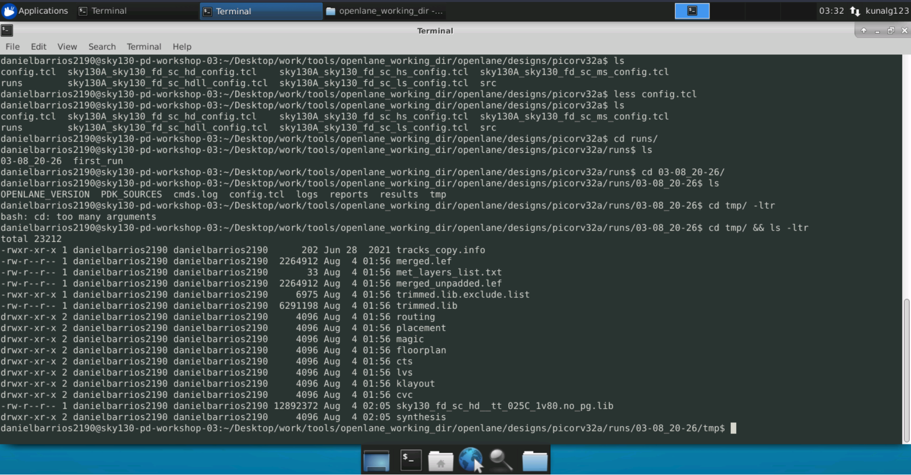
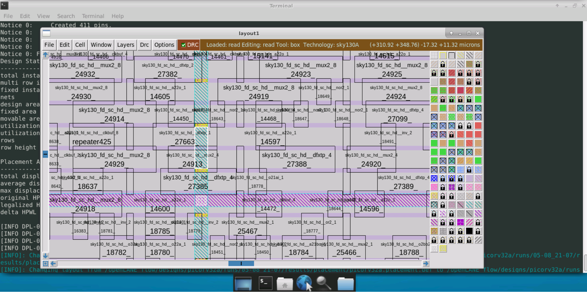

# OpenLane-Workshop
This repository contains all the steps made during the VSD-AIT ADVANCED PHYSICAL DESIGN USING OPENLANE/SKY130 Workshop. 
This will be described step by step and day by day.

# Day 1
## Exploring the files
To understand what is inside the PDKs, we will enter the folders

Here we can see the libs.ref folder which contains the standard cells 

This folders contain different types of information such as the verilog description, the layout information, power and timing of each cells and much more

On the libs.tech folder, there are the information used by the tools such as magic, ngspice, xschem and others

## Using OpenLane
To understand more clearly what happens while we run OpenLane we run the docker image container and run the ./flow.tcl file in the interactive mode, this lets us go step by step.
First of all we need a design such as picorv32a which comes base with the tool, and prepare it using the -prep command

We can see the results of this in the tmp folder

Then we are going to run a synthesis that takes info from the design ./config.tcl file, overriding system default variables, like clock periods, paths and other information

Using the run_synthesis command

Here we can see that it was a successful run, and we can analyze the reports on the folder of the same name.

We can see how many cells we used (A total of 14876 of which 1613 are Flipflops and 1664 are buffers, giving us a Flop Rate of around 10.84%)

# Day 2
## Floorplanning
First of all we will check what variables are used in the Floorplanning stage

Here are some optional variables to use during the floorplanning stage letting us configure things like the aspect ratio, the extension of the IO pins, the Die area and such. Then we can take these variables and use then in the corresponding .tcl file or let them be the default settings. Running the run_floorplan command we can see its effect

Then checking the log files we can see that the lef and def files were generated

We can also check the config.tcl used this run and see which variables were changed

Our changes to the metals were successful as well as the core size. Checking also the def and lef files using magic we get the following

We used a Die area of 660.685 um * 671.405 um = 443587.212 um^2

## Placement
First we are going to do the global placement which is a rough sketch of the placement, usign the run_placement command. This will iterate the position of the blocks until the timing is correct. And then we can legalized with the detailed placement

On magic we can check the changes as such. If we zoom in we can see the standard cells placed in the design

# Day 3
## STD Cells SPICE
First of all we are not designing a standard cell from zero, we will use one from Nickson Jose (Thanks!) : git clone https://github.com/nickson-jose/vsdstdcelldesign.git.

Opening this file in magic shows the following

We make sure everything is connected according to our circuit and so we press S twice to check connectivity of each pin

Then to make sure this is the logic function we want, and to characterize the cell we have to use SPICE, to do that first extract the cell using the command extract all , and creating the .ext file then converting it to SPICE with ext2spice

Here we have to change the scale in which the parameters are used, for example magic's minimun unit is 0.01um so we change it to that. We also have to add references to the libs used. These are nshort.lib and pshort.lib
We are gonna test the circuit using a pulse wave source as its entrance, so we add a PULSE source, then to setup VDD and VSS we add DC voltage sources. And finally using the tran directive we run a transient simulation using ngspice

Here we can see the aproximate rise time (20% -> 80%) = 0.0663ns and the propagation delay = 0.06897ns if the output capacitance is 2.4f F

# Day 4
## Track Info
It is important to know how much space the standard cell occupies, and how much of it is correctly positioned. For this we will check the tracks.info file found inside the pdks folder, this will help us create a grid to position the layout correctly

